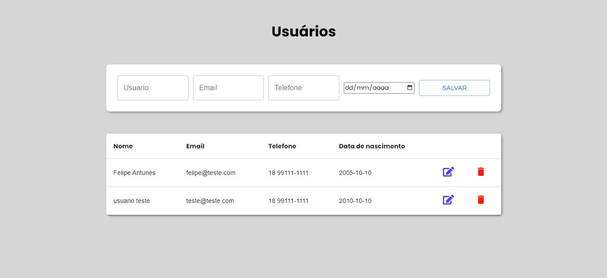

<h1>Cadastro de usuaário</h1>

<h3>Este é um projeto simples desenovlvildo em react e suas tecnologias</h3>

Consiste em uma plataforma de cadastro de usuários, totalmente integrado com api de JSON e banco de dados MySQL

O backend foi desenvolvido em Node.js com express e api de JSON

<h4>Autor:</h4>

Felipe Antunes da Costa
